# Arquitectura de Software - TP2 - Grupo Hasbullah

## **Integrantes**
- Andresen Joaquín (102707)
- Arrachea Tomás (104393)
- Demarchi Lucas (104525)
- Vázquez Lareu Román (100815)

## **Introducción**
En el siguiente trabajo práctico se desplegará una API web en el servicio cloud de Azure. Se hará un análisis sobre varias configuraciones del servidor y se intentará extraer conclusiones acerca de las estrategias posibles para resolver las distintas limitaciones que se presentan al poner a prueba las configuraciones previamente mencionadas.

Esto se hará sobre una aplicación en node que tendrá endpoints que utilizaremos como prueba para evaluar los resultados. La consultas de cada uno de estos endpoints implica internamente el llamado a una API externa para conseguir el recurso en cuestión. 

Los endpoints son los siguientes:
* /fact: devuelve :aleatoriamente un hecho
* /metar: recibe como parámetro una estacion y devuelve el estado de la misma
* /space_news: portal de noticias

## **Escenario de prueba**
Cada configuración se pondrá a prueba utilizando un escenario diseñado con artillery.

El escenario consiste en los siguientes pasos:
- Pause: se realiza una pausa de 5 segundos
- Start: mantiene 1 request por segundo durante 30 segundos
- Ramp up: comienza con 1 requests por segundo y llega hasta 5 requests por segundo en un plazo 60 segundos
- Plain: mantiene 5 requests por segundo durante 60 segundos
- Slow down: comienza con 5 requests por segundo y baja hasta 1 request por segundo en un plazo 60 segundos

## **Configuraciones**
A continuación se analizará el rendimiento de tres configuraciones distintas.

## Configuración 1: Un solo servidor
Esta configuración consiste en una sola instancia de la aplicación sin utilizar cache. Es decir que todos los requests van a ser manejados por este único servidor. Este será tomado como el caso base. Solo se marcarán los aspectos salientes obtenidos de esta prueba, a efectos de ser usados como punto de comparación en los siguientes escenarios.

#### Estadisticas para endpoint /fact
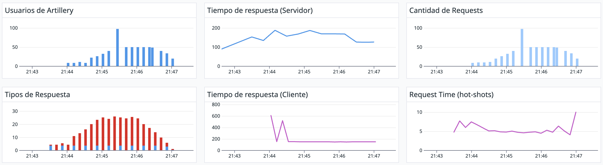

#### Estadisticas para endpoint /space_news
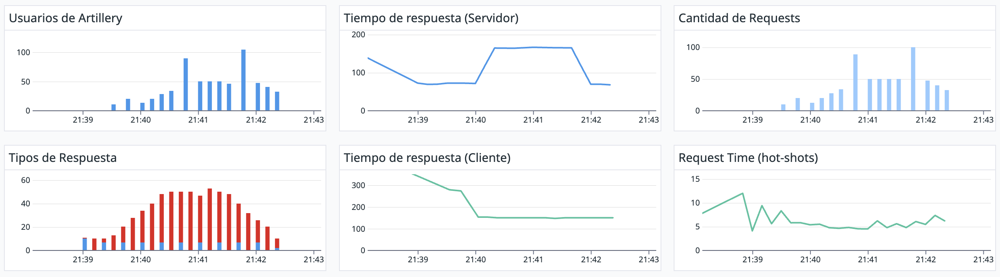

#### Estadisticas para endpoint /space_news con 1 request cada 2 segundos
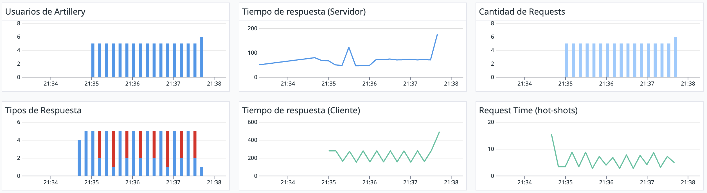

#### Estadisticas para endpoint /metar
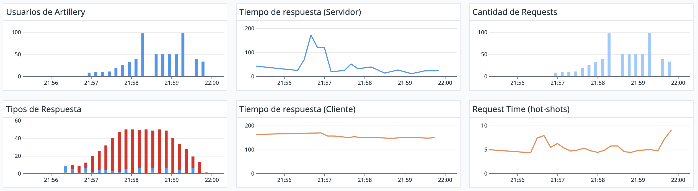

La configuración 1, que consiste en una sola instancia de la aplicación sin utilizar cache, funciona "mal" para los tres endpoints (/fact, /space_news y /metar) y para todos ellos en conjunto, ya que tiene un alto porcentaje de fallas (gráfico de tipos de respuesta, donde azul es 200 y rojo es 500) en las solicitudes y el promedio de los tiempos de respuesta del cliente son cercanos al doble que los del servidor. La cantidad de errores que se devuelven se debe a que la API externa tiene un rate limit, a partir del cual las request empiezan a devolver error.

Esta configuración puede tener problemas de escalabilidad y robustez si se aumenta la cantidad de solicitudes o si se presentan errores en la API externa o en la conexión a la misma. Por lo tanto es indispensable probar otras configuraciones que puedan mejorar el rendimiento y la fiabilidad de la aplicación.

A continuación se evaluarán 2 configuraciones que buscarán mejorar atributos como la performance y escalabilidad.

## Configuracion 2: Un servidor con Redis
Esta configuración es exactamente igual que la anterior con el agregado de una caché que será muy util para almacenar ciertos datos. La política de caché utilizada consiste en que cada vez que se hace una petición a una API externa, el recurso obtenido se almacena durante 5 segundos en la caché.

#### Estadisticas para endpoint /fact
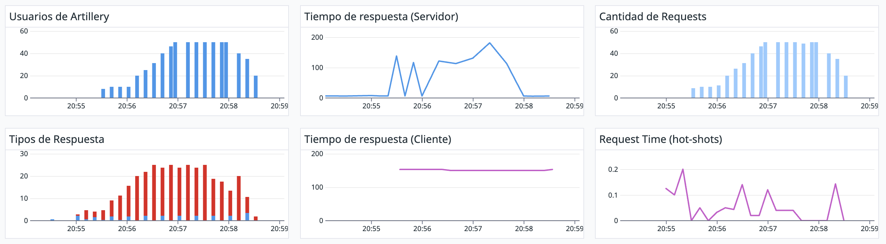

#### Estadisticas para endpoint /space_news
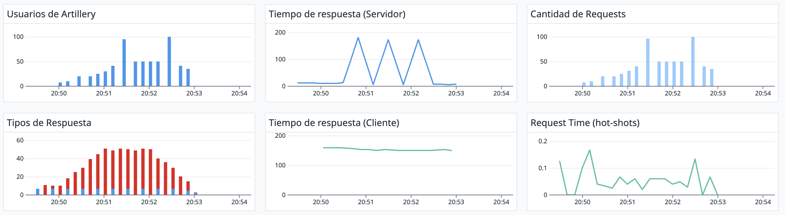

#### Estadisticas para endpoint /space_news con 1 request cada 2 segundos
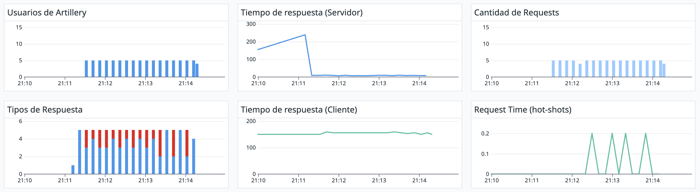

#### Estadisticas para endpoint /metar
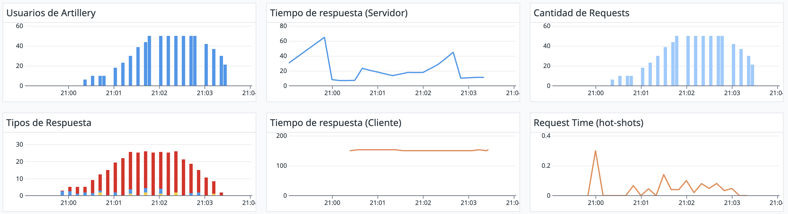

La configuración 2, que consiste en una sola instancia de la aplicación con cache, funciona mejor que la configuración 1 para los dos endpoints que probamos (/metar y /space_news), ya que mejora el tiempo de respuesta del servidor.

Sin embargo, sigue habiendo muchas requests fallidas. Para atacar ese problema, una posible solución sería agrandar la caché. Por ejemplo, en el endpoint de metar esto permitiría que se almacene el resultado de varias de las estaciones, lo que disminuiría aún más la cantidad de requests realizadas a la API externa, evitando explotar el rate limit. También se podría elevar el tiempo de expiración de los datos, teniendo en cuenta qué tan seguido varian los datos. Esta implementación de la cache permitiría disminuir la cantidad de fallos y el tiempo de respuesta promedio.

## Configuracion 3: Tres servidores
Esta última configuración consiste en tres instancias de la aplicación corriendo detras de un load balancer.

#### Estadisticas para endpoint /fact
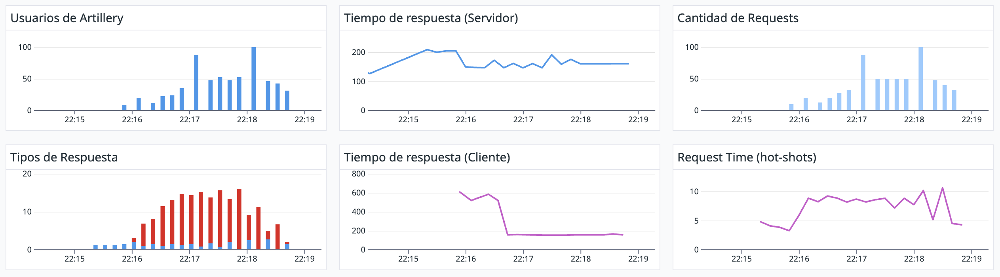

#### Estadisticas para endpoint /space_news
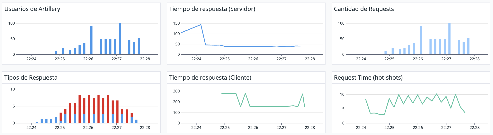

#### Estadisticas para endpoint /space_news con 1 request cada 2 segundos
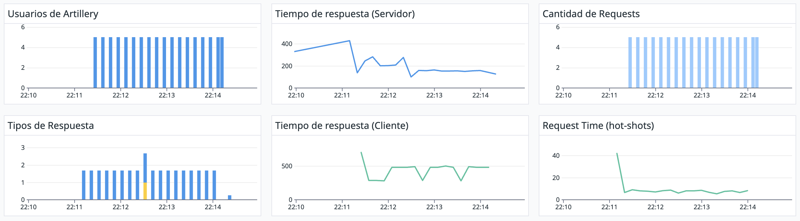

#### Estadisticas para endpoint /metar
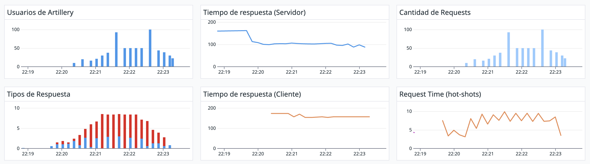

Al aumentar las instancias de la aplicación, se obuvieron tiempos de respuesta similares. Esto lleva a pensar que la limitante del tiempo de respuesta está dado por el llamado a la API externa, y no se ve afectado al agregar instancias.

En cambio, se ve que en el tipo de respuestas obtenidas hay menos respuestas de error. Esto puede deberse a que el rate limit de la API externa se aplica por separado para cada una de las 3 instancias, lo que permitió que haya más requests existosas en total.

Si se escala aún mas la cantidad de instancias, seguiría mejorando la cantidad de requests exitosas a la API externa.

En este escenario, se logró incrementar  la confiabilidad del servidor al reducir de  la cantidad de errores. Esto se traduce en un funcionamiento más confiable y estable del sistema. Al permitir que se agreguen más instancias, el servidor tiene la capacidad de manejar una mayor cantidad de solicitudes de manera más eficiente. Esto significa que puede adaptarse mejor a un aumento en la demanda.

## **Conclusión**

Tras analizar los resultados, se pudo comprobar que el agregado de la caché mejoró la performance del servicio, y multiplicar las instancias del servidor permitió mejorar la confiabilidad y la escalabilidad.

Ambas tacticas utilizadas permiten disminuir la cantidad de requests realizadas a la API externa, lo que permite aumentar la cantidad de peticiones exitosas de nuestro servicio. La opción de la cache tiene la ventaja de ser más económica y de impactar también positivamente en la performance, por lo que sería la primer táctica a implementar .
